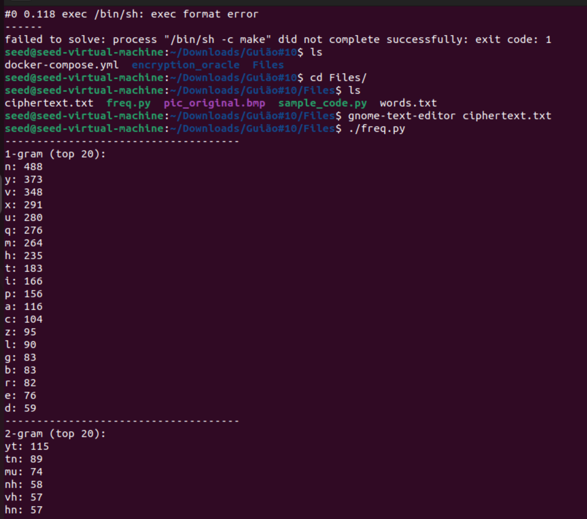
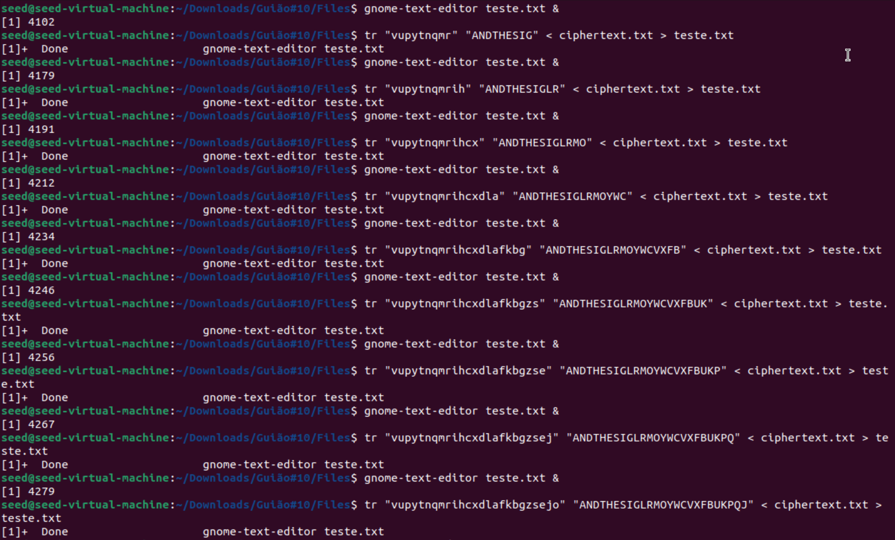
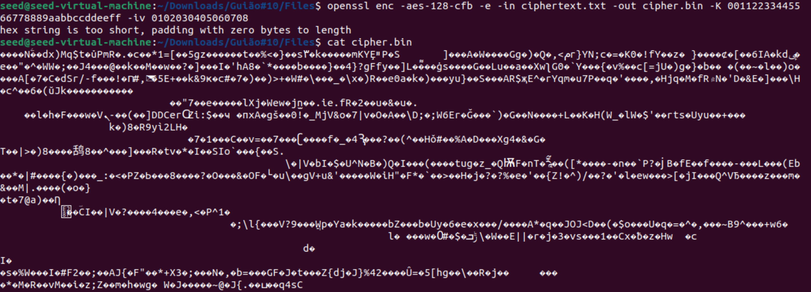
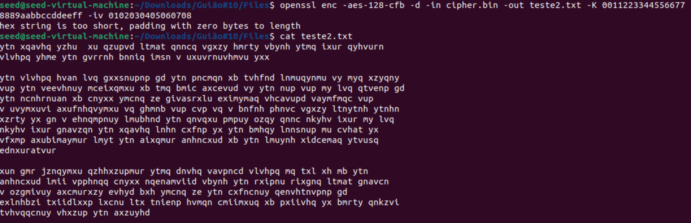

# Trabalho realizado nas Semanas #10, #11 e #12
## SEED Labs - Secret Key Encryption 

### Task 1: Frequency Analysis

Após analizarmos o ficheiro "ciphertext.txt", fomos mudando letra a letra conforme a frequência de letras/ bigramas/ trigramas e conforme as palavras que íamos desvendando

### Task 2: Encryption using Different Ciphers and Modes

Começamos por encriptar o conteúdo do ficheiro ciphertext.txt e criamos um ficheiro cipher.bin para guardar o conteúdo encriptado. Para isso utilizamos a flag -e (encrypt) e o cipher type -aes-128-cfb. 

Para verificarmos que a encriptação foi bem sucedida, utilizamos o comnado inverso, para podermos desencriptar o ficheiro cipher.bin e compararmos ao original. Para isso utilizamos a flag -d (decrypt) e trocamos o ficheiro in para cipher.bin e criamos o ficheiro teste2.txt para receber o conteúdo.

## Task 3: Secret-Key Encryption Lab

