# Trabalho realizado nas Semanas #11, #12e #13
## SEED Labs - Public Key Infrastructures

### 3 Lab Tasks
### 3.1 Task 1: Becoming a Certificate Authority (CA)

Começámos por copiar o ficheiro de certificado (openssl.cnf) para o nosso diretório local uma vez que iríamos fazer alterações neste ficheiro.

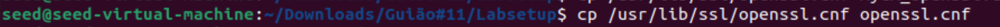

Posteriormente, descomentamos a linha "unique_subject" para permitir a criação de certificados com o mesmo assunto. Isso significa que certificados com o mesmo "assunto" visto que será útil para futuras tarefas.

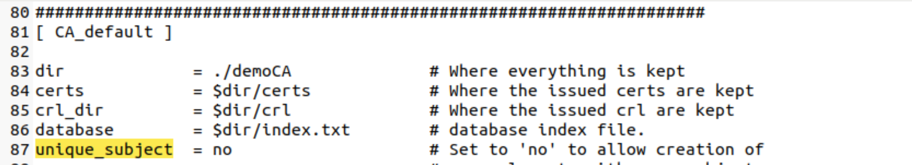

Começamos por criar um diretório "demoCA" para termos a nossa prórpia autoridade de certificação. Criámos subdiretórios como "crl", "certs" e "newcerts" para usarmos futuramente para o armazenamento de certificados.

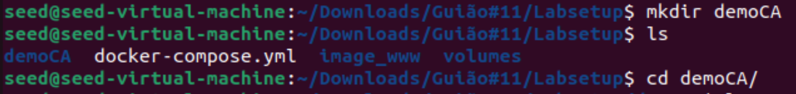

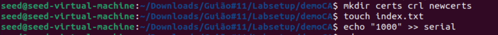

Uma autoridade de certificação (CA) emite certificados digitais. Neste caso, está a ser sugerida a geração de um certificado autoassinado para a CA. O termo "autoassinado" significa que a própria CA atesta a autenticidade do seu próprio certificado.

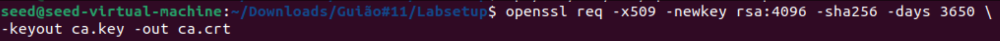

Para isso foi necessário completarmos com algumas informações:

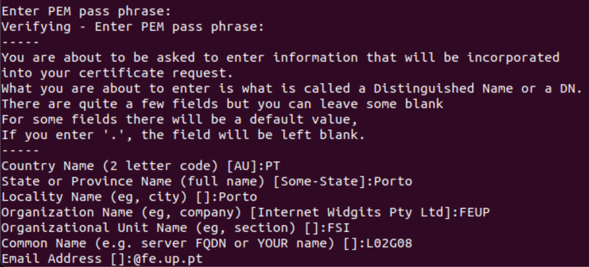

Podemos utilizar os seguintes comandos para visualizar o conteúdo decodificado do certificado X509 e da chave RSA (-text para decodificar o conteúdo em texto simples; -noout para não imprimir a versão codificada).

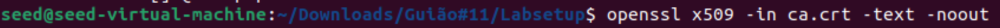

Este comando utiliza o OpenSSL para decodificar e exibir o conteúdo do certificado X509 em formato de texto. Sendo esse:

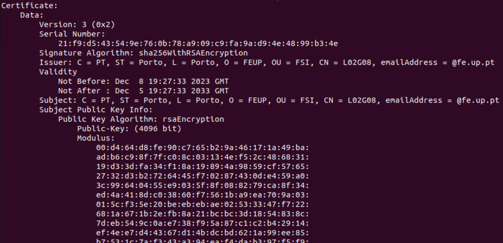

Já o comando:

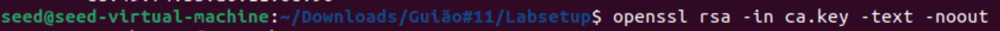

usa o OpenSSL para decodificar e exibir o conteúdo da chave RSA em formato de texto. Sendo este:

#### Questões
#### 1 - Que parte do certificado indica que este é um certificado de CA?

Através da flag "CA".
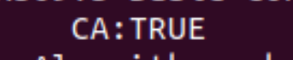

#### 2 - Que parte do certificado indica que este é um certificado autoassinado?

É autoassinado uma vez que o campo "issuer" e "subject" indicam os mesmos valores.

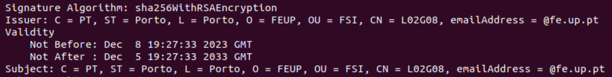

#### 3 - No algoritmo RSA, temos um expoente público e, um expoente privado d, um módulo n e dois números secretos p e q, tais que n = pq. Identifique os valores desses elementos no teu certificado e arquivos de chave.

O "n" seria o "modulus":

O "p" seria o "prime1":

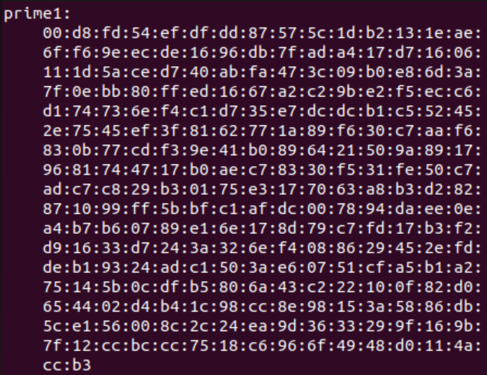

O "q" seria o "prime2":

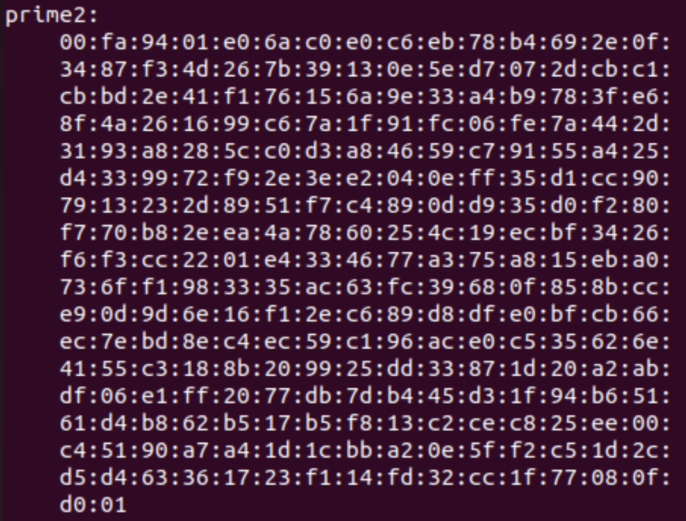

### 3.2 Task 2: Generating a Certificate Request for Your Web Server

Este comando é utilizado para gerar um pedido de assinatura de certificado (CSR) usando uma nova chave de servidor.
A flag -addext com a extensão SAN é crucial para incluir nomes de domínio adicionais no certificado. Isso ajuda a conectar diferentes URLs que apontam para o mesmo servidor web ao mesmo certificado.

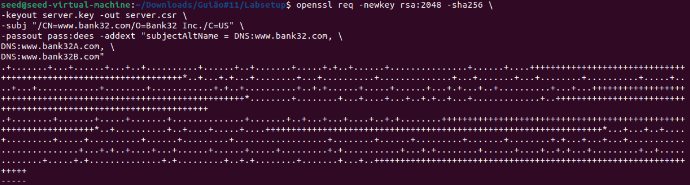

Após gerar o CSR, o seguinte comando é utilizado para exibir o conteúdo do CSR em formato legível:

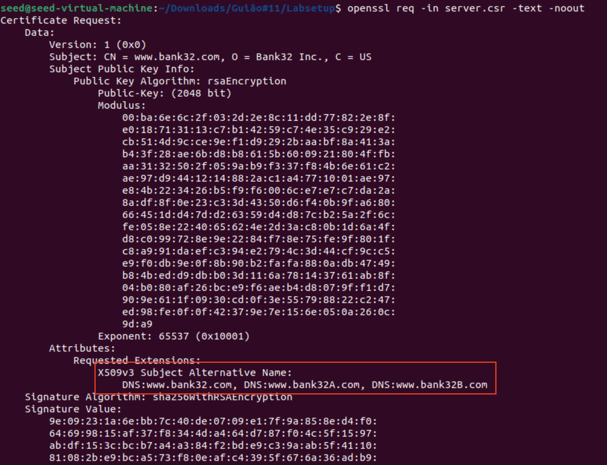

### 3.3 Task 3: Generating a Certificate for your server

Este comando é utilizado para transformar o pedido de assinatura de certificado num certificado X509, utilizando a assinatura da CA e converte "server.csr" num certificado autoassinado, "server.crt".

Antes de assinar o certificado, é mencionado que a extensão de campo não é copiada por padrão do pedido para o certificado final. Para ativar essa opção, é sugerido descomentar a linha no ficheiro de configuração:

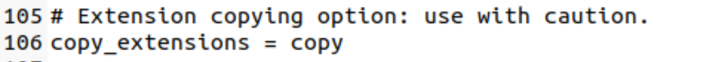

Descomentar esta linha permitirá que o comando "openssl ca" copie a extensão do pedido para o certificado final.

Depois de assinar o certificado, o seguinte comando é utilizado para imprimir o conteúdo decodificado do certificado e verificar se os nomes alternativos estão incluídos:

Verifica-se assim que todos os nomes que inserimos na tarefa 2 são impressos aqui também.

### 3.4 Task 4: Deploying Certificate in an Apache-Based HTTPS Website

O exemplo configura um site HTTPS em https://www.bank32.com (porta 443) usando o Apache. Define o nome do servidor (ServerName), o diretório dos arquivos do site (DocumentRoot), e permite diferentes nomes de servidor usando entradas ServerAlias. O certificado do servidor e a chave privada são copiados para o container na pasta /certs durante a construção, e o módulo SSL do Apache é habilitado, permitindo que o site funcione com segurança usando HTTPS.

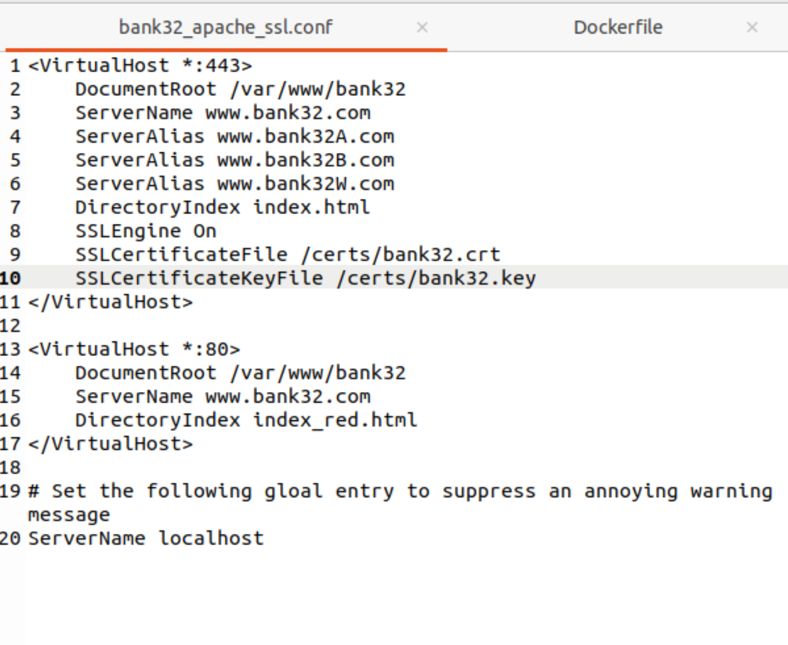

Lançamos o website através destes comandos: 
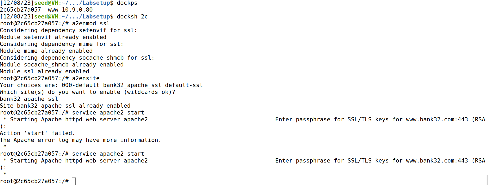

E ao inserir no navegador "www.bank32.com" reparámos que este website não era uma ligação segura.

Para isso acedemos